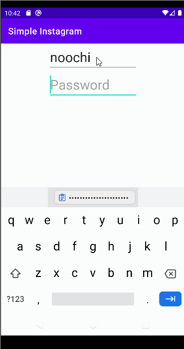

# Project 3 - *Instagram*

**SimpleInstagram** is a photo sharing app similar to Instagram but using Parse as its backend.

Time spent: **18** hours spent in total

## Instagram Part 2
### User Stories

The following **required** functionality is completed:

- [x] User can view the last 20 posts submitted to "Instagram".
- [x] The user should switch between different tabs - viewing all posts (feed view), compose (capture photos form camera) and profile tabs (posts made) using fragments and a Bottom Navigation View. (2 points)
- [x] User can pull to refresh the last 20 posts submitted to "Instagram".

The following **optional** features are implemented:

- [ ] User sees app icon in home screen and styled bottom navigation view
- [ ] Style the feed to look like the real Instagram feed.
- [ ] User can load more posts once he or she reaches the bottom of the feed using infinite scrolling.
- [ ] Show the username and creation time for each post.
- [ ] User can tap a post to view post details, including timestamp and caption.
- [ ] User Profiles
- [ ] Allow the logged in user to add a profile photo
- [ ] Display the profile photo with each post
- [ ] Tapping on a post's username or profile photo goes to that user's profile page and shows a grid view of the user's posts 
- [ ] User can comment on a post and see all comments for each post in the post details screen.
- [ ] User can like a post and see number of likes for each post in the post details screen.

The following **additional** features are implemented:

- [ ] List anything else that you can get done to improve the app functionality!

## Video Walkthrough

Here's a walkthrough of implemented user stories:

GIF created with [LiceCap](http://www.cockos.com/licecap/).

## Notes

Although this part was supposed to be the easier part of the project, I did run into some challenges when trying to finish the project. One of the challenges were trying to figure out how to go from the Compose Fragment to the Feed Fragment. Even though this wasn't a requirement in the user stories, I thought that it would make sense for the user to see their newly saved post in their feed. However, because I am fairly new to the concept of fragments, I wasn't sure how to get the user to go to the feed after submitting a post. I tried watching videos and reading other sources to help me understand how change from one fragment to another. After viewing various sources, I realized that in order to change from one fragment to another, we simply just include this line of code inside the submitPost function: 

**fragmentManager?.beginTransaction()?.replace(R.id.flContainer, FeedFragment())?.commit()** 

and it will send the user to the Feed Fragment once the user clicks the submit button. 

## Open-source libraries used

- [Android Async HTTP](https://github.com/codepath/CPAsyncHttpClient) - Simple asynchronous HTTP requests with JSON parsing
- [Glide](https://github.com/bumptech/glide) - Image loading and caching library for Android

## Instagram Part 1
### User Stories

The following **required** functionality is completed:

- [x] User can sign up to create a new account using Parse authentication.
- [x] User can log in and log out of his or her account.
- [x] The current signed in user is persisted across app restarts.
- [x] User can take a photo, add a caption, and post it to "Instagram".

The following **optional** features are implemented:

- [ ] User sees app icon in home screen and styled bottom navigation view
- [ ] Style the feed to look like the real Instagram feed.
- [ ] After the user submits a new post, show an indeterminate progress bar while the post is being uploaded to Parse.

The following **additional** features are implemented:

- [ ] List anything else that you can get done to improve the app functionality!

## Video Walkthrough

Here's a walkthrough of implemented user stories:

**Signing in a user, making a new post, and logging out user**

**Signing up a new user**

**Current user is still signed in after app restarts**

GIF created with [LiceCap](http://www.cockos.com/licecap/).

## Notes

This overall project was very difficult for me because I ran into various problems. One of these problems were trying to debug my code when I ran into an error. Because this project was much bigger than the previous ones, running into errors were more likely to happen for me. 
For example, my function for submitting a post was running into an error when I included the method onLaunchCamera(). During this time, I was afraid that the error was because I followed the steps in the walkthrough incorrectly for the
MainActivity file. However, when I was reviewing the console app, I noticed that there was an error because I set the image in the Post kotlin file as KEY_DESCRIPTION instead of KEY_IMAGE. After realizing my mistake, I immediately fixed it. Although this was a challenging project,
I learned a lot about parse, bitmaps (from when asked to resize image) and had more practice in understanding intents and onClickListeners. 

## Open-source libraries used

- [Android Async HTTP](https://github.com/codepath/CPAsyncHttpClient) - Simple asynchronous HTTP requests with JSON parsing
- [Glide](https://github.com/bumptech/glide) - Image loading and caching library for Android

## License

    Copyright [2022] [Christy Xiong]

    Licensed under the Apache License, Version 2.0 (the "License");
    you may not use this file except in compliance with the License.
    You may obtain a copy of the License at

        http://www.apache.org/licenses/LICENSE-2.0

    Unless required by applicable law or agreed to in writing, software
    distributed under the License is distributed on an "AS IS" BASIS,
    WITHOUT WARRANTIES OR CONDITIONS OF ANY KIND, either express or implied.
    See the License for the specific language governing permissions and
    limitations under the License.
